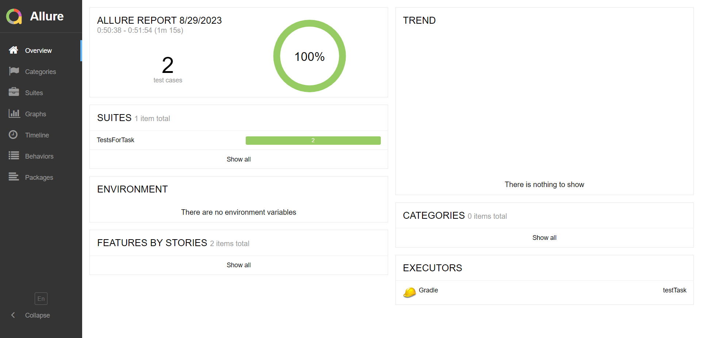
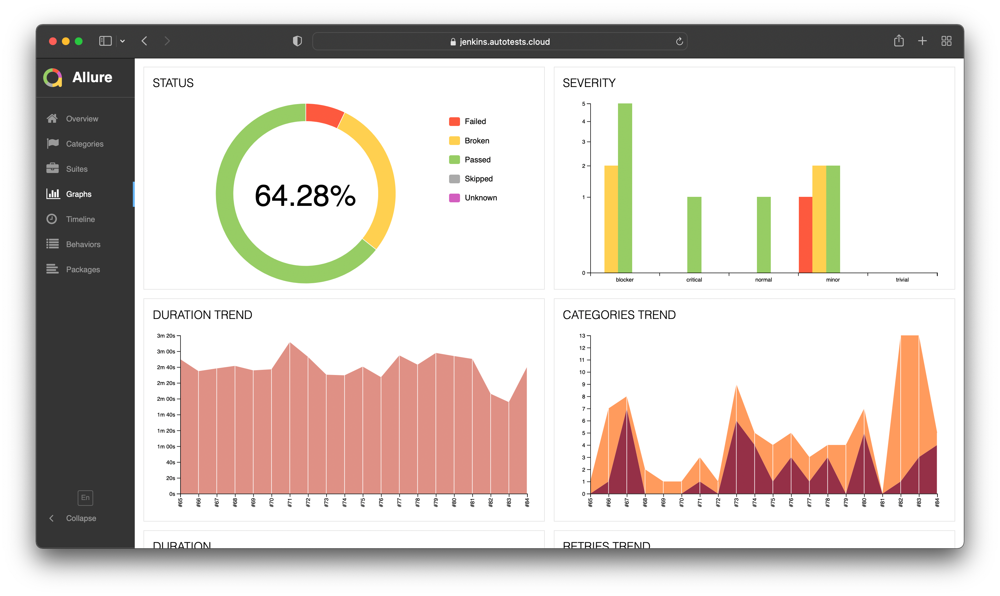
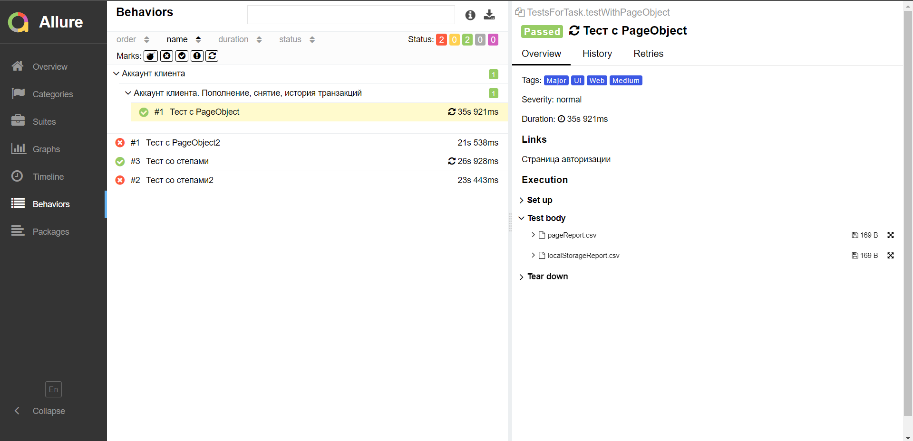
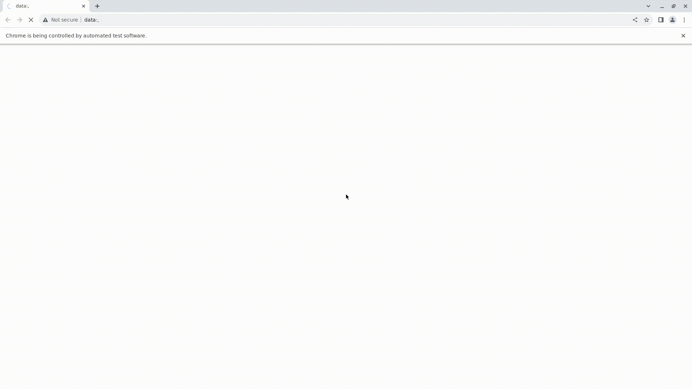

# Проект по автоматизации тестирования веб-приложения [XYZ Bank](https://www.globalsqa.com/angularJs-protractor/BankingProject/#/login)

<p align="center">

</p>

##  Содержание

> ➠ [Покрытый функционал](#-покрытый-функционал)
>
> ➠ [Технологический стек](#-технологический-стек)
>
> ➠ [Отчет о результатах тестирования в Allure Report](#-отчет-о-результатах-тестирования-в-allure-report)
>
> ➠ [Пример запуска теста в Selenoid](#-пример-запуска-теста-в-selenoid)

##  Покрытый функционал

> Разработаны автотесты на <code>UI</code>.

### UI

- [x] Авторизация клиента
- [x] Пополнение баланса
- [x] Снятие со счета
- [x] Проверка баланса
- [x] Проверка проведенных транзакций

[Вернуться к содержанию](#-содержание) :top:

##  Технологический стек

<p align="center">


</p>

> В данном проекте автотесты написаны на <code>Java</code> с использованием фреймворка <code>Selenium</code> для UI-тестов.
>
> <code>Selenoid</code> выполняет запуск браузеров в контейнерах <code>Docker</code>.
>
> <code>Selenium Grid</code> выполняет запуск браузеров локально <code>Local</code>.
>
> <code>Allure Report</code> формирует отчет о запуске тестов.
>
> Для автоматизированной сборки проекта используется <code>Gradle</code>.
>
> В качестве библиотеки для модульного тестирования используется <code>JUnit 5</code>.

[Вернуться к содержанию](#-содержание) :top:

### :joystick: Параметры запуска

> <code>Selenoid</code> – для запуска в удаленном браузере использовать метод setUpSelenoid класса TestBase.
> Должен быть установлен Docker с контейнером Selenoid на хосту (_по умолчанию порт - <code>:4444</code>_)
> 
> <code>Selenium Grid</code> – для запуска сессии в Selenium Grid локально необходимо использовать метод setUpSeleniumGrid.
> Должен быть установлен Selenium Grid на хосту (_по умолчанию порт - <code>:4444</code>_)

### :joystick: Формирование отчета Allure

```
allure serve build/allure-results
```

> :exclamation: Для формирования отчета должен быть установлен <code>Allure</code>.

[Вернуться к содержанию](#-содержание) :top:

##  Отчет о результатах тестирования в [Allure Report](https://jenkins.autotests.cloud/job/jjfhj-mvideo_project/allure/)

> [**Allure-framework**](https://habr.com/ru/company/sberbank/blog/358836/) используется в качестве инструмента для построения отчетов о прогоне автотестов.
> Он позволяет получить информацию о ходе выполнения тестов, а также прикрепить скриншоты, логи и видео к формируемому отчету.
> Имеется возможность указать различные теги, приоритеты и прочую сопутствующую информацию для тестов.
>
> <details>
> <summary> :point_left: Страница <code>Overview</code> </summary>
>
> Сраница <code>Overview</code> является главной страницей Allure-отчета.
>
> **Состоит из следующих блоков:**
>
> + Блок <code>ALLURE REPORT</code> – включает в себя дату и время прохождения теста, общее количество прогнанных кейсов, а также диаграмму с указанием процента и количества успешных, упавших и сломавшихся в процессе выполнения тестов.
>
> + Блок <code>TREND</code> – показывает тренд прохождения тестов от сборки к сборке.
>
> + Блок <code>SUITES</code> – показывает распределение результатов тестов по тестовым наборам.
>
> + Блок <code>ENVIRONMENT</code> – показывает тестовое окружение, на котором запускались тесты.
>
> + Блок <code>CATEGORIES</code> – показывает распределение неуспешно прошедших тестов по видам дефектов.
>
> + Блок <code>FEATURES BY STORIES</code> – показывает распределение тестов по функционалу, который они проверяют.
>
> + Блок <code>EXECUTORS</code> – показывает исполнителя текущей сборки. Если выполнение производилось на инструменте CI (например, на Jenkins), то будет предоставлена информация о джобе и номере сборки.
>
> </details>

### :dart: Главная страница Allure-отчета

<p align="center">

</p>

> <details>
> <summary> :point_left: Страница <code>Graphs</code> </summary>
>
> На странице <code>Graphs</code> можно получить информацию о тестовом прогоне в графическом виде: статус прогона, распределение тестов по критичности, длительности прохождения, перезапускам, категориям дефектов и так далее.
> </details>

### :dart: Информация о тестовом прогоне в графическом виде

<p align="center">

</p>

> <details>
> <summary> :point_left: Страница <code>Behaviors</code> </summary>
>
> На странице <code>Behaviors</code> тесты сгруппированы по проверяемому функционалу _(Epic, Feature, Story)_.
> </details>

### :dart: Группировка тестов по проверяемому функционалу

<p align="center">

</p>

> <details>
> <summary> :point_left: <b>Прочие страницы</b> </summary>
>
> + Страница <code>Categories</code> – данная страница предоставляет информацио о распределении дефектов по их видам.
>
> + Страница <code>Suites</code> – на данной странице представляется стандартное распределение выполнявшихся тестов по тестовым наборам или классам, в которых находятся тестовые методы.
>
> + Страница <code>Timeline</code> – данная страница визуализирует временные рамки прохождения каждого теста.
>
> + Страница <code>Packages</code> – на этой странице тесты сгруппированы по пакетам, в которых лежат тестовые классы.
>
> </details>

[Вернуться к содержанию](#-содержание) :top:

##  Пример запуска теста в Selenoid

> К каждому тесту в отчете прилагается видео. Одно из таких видео представлено ниже.

<p align="center">

</p>

[Вернуться к содержанию](#-содержание) :top:
